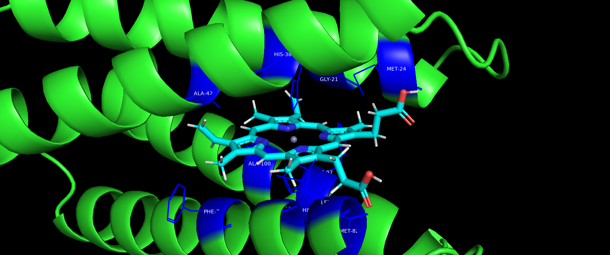
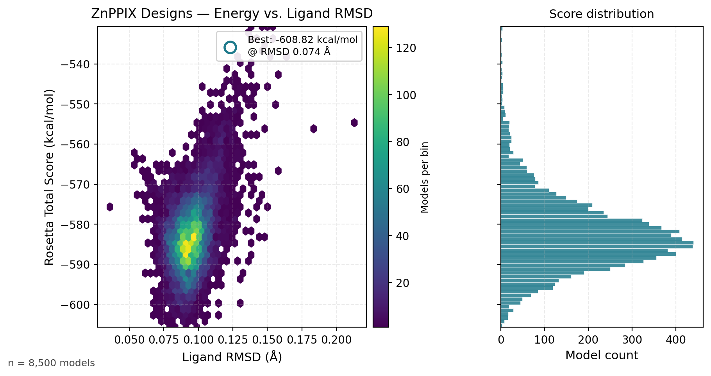
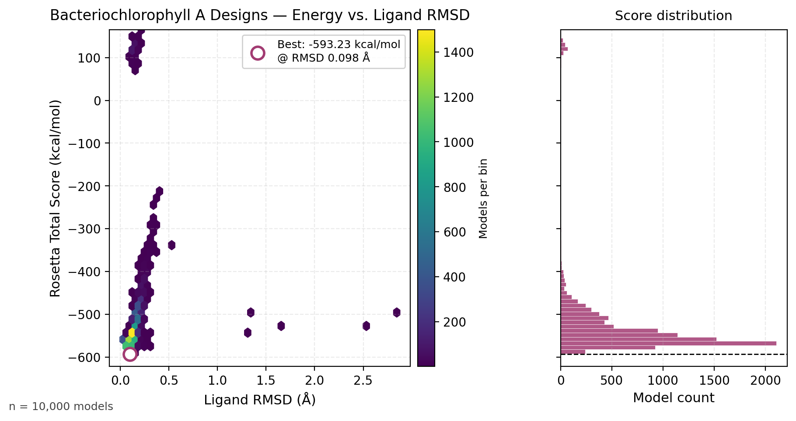

# Computational Redesign of CytbX for Non-Heme Cofactor Binding

> **Computational protein-design study** retargeting the de novo four-helix-bundle membrane protein
> **CytbX** to bind two non-native cofactors — **Zinc Protoporphyrin IX (ZnPPIX)** and
> **Bacteriochlorophyll A (BCL)** — using Rosetta with the `franklin2019` membrane score function.
>
> Research project — **University of Bristol**, School of Biochemistry. Supervisor: **Dr. Paul Curnow**.

<p align="center">
  
  <br>
  <em>Figure 1 — CytbX (green helices) coordinating a ZnPPIX cofactor (cyan, sticks) inside its membrane-embedded four-helix bundle. Histidine residues directing the binding pocket are shown in blue.</em>
</p>

---

## 1. Motivation

CytbX is a **de novo designed integral membrane protein** engineered by the Anderson/Curnow groups
to bind two b-type heme groups inside an antiparallel four-helix bundle (Hardy *et al.*, 2023). It
provides a minimal, evolutionarily unbiased scaffold for studying redox cofactors in lipid bilayers —
but its native chemistry is restricted to iron porphyrins.

Two open questions motivate this project:

- **Can the same scaffold accommodate cofactors that differ in metal centre, geometry, or volume
  without losing membrane stability?** A positive answer would establish CytbX as a *modular platform*
  for biosensors, photosynthetic mimics, and synthetic redox circuitry.
- **What residue-level changes are required for each cofactor, and do they reveal generalisable
  design principles for binding zinc-tetrapyrroles and magnesium-tetrapyrroles in a hydrophobic
  bilayer environment?**

Two structurally distinct, biologically meaningful cofactors were selected:

| Cofactor   | Metal | Tetrapyrrole class  | Relevance                                                                |
| ---------- | ----- | ------------------- | ------------------------------------------------------------------------ |
| **ZnPPIX** | Zn²⁺  | Protoporphyrin IX   | Photodynamic therapy, fluorescent biosensors, marker for iron deficiency |
| **BCL**    | Mg²⁺  | Bacteriochlorophyll | Light harvesting; energy transfer in photosynthetic reaction centres     |

---

## 2. Methods at a Glance

A reproducible, fully automated Rosetta protocol was developed for each cofactor and run on the
University of Bristol's **BlueCrystal4** HPC cluster.

```text
        apo-CytbX (X-ray-derived model)
                 │
                 ▼
   Cofactor placement in PyMOL ─── Conformer library (Frog2, ≤ 50 conformers)
                 │
                 ▼
   RosettaScripts protocol (franklin2019 membrane score function)
   ┌──────────────────────────────────────────────────────────────┐
   │  AddMembraneMover · MembranePositionFromTopologyMover        │
   │  FavorNativeResidue (bonus = 1.0)                            │
   │  Transform (low-res ligand docking)                          │
   │  HighResDocker · PackRotamersMover · FinalMinimizer          │
   │  InterfaceScoreCalculator                                    │
   └──────────────────────────────────────────────────────────────┘
                 │
                 ▼
   18,500 candidate models (8,500 ZnPPIX + 10,000 BCL)
                 │
                 ▼
   Filter by total score → top 0.5% → cluster → align (Clustal Ω)
                 │
                 ▼
   Structural & sequence analysis (PyMOL, Jalview)
```

**Mutable interface.** Residues within 3–6 Å of the cofactor were designated `ALLAAxC` (any amino
acid except cysteine). Catalytic histidines **H38 and H96** were locked as `NATRO` to preserve the
native heme-coordination axis; all other positions were repackable but not mutable. See
[`design/znh/cytbx_znh_resfile.txt`](design/znh/cytbx_znh_resfile.txt).

**Membrane handling.** A 4-segment spanfile derived from the X-ray topology
([`design/znh/cytbx_znh.span`](design/znh/cytbx_znh.span)) was supplied to the membrane mover; lipid
penetration was disabled (`-mp:lipids:has_pore false`) and hydrogen bonding was scored explicitly.

The full RosettaScripts protocol used is [`design/znh/ZNH_ligand.xml`](design/znh/ZNH_ligand.xml).
For the complete methodology (parameter generation, conformer libraries, scoring, post-processing),
see [`docs/methods.md`](docs/methods.md).

---

## 3. Results

### 3.1 ZnPPIX — recovers a *better* binding pocket than designed for

<p align="center">
  
  <br>
  <em>Figure 2 — Rosetta total score vs. ligand RMSD across 8,500 ZnPPIX design trajectories. The
  best model (open circle) reaches −608.82 kcal/mol with 0.074 Å ligand displacement.</em>
</p>

| Metric                                              | Value                |
| --------------------------------------------------- | -------------------- |
| Models evaluated                                    | **8,500**            |
| Initial score (placed cofactor, no design)          | **+857.97** kcal/mol |
| Best score                                          | **−608.82** kcal/mol |
| Net stabilisation                                   | **~1,467** kcal/mol  |
| Best ligand RMSD vs. starting placement             | 0.074 Å              |
| Top-model sequence identity (5 best vs. each other) | **>94 %**            |

**Recurring mutations across the top-5 designs** (positions are 1-indexed against the CytbX
sequence): F76 → T/R, F97 → T/V/M, A100 → L. See
[`sequences/znh_top_models.fasta`](sequences/znh_top_models.fasta) and
[`figures/znh_alignment.png`](figures/znh_alignment.png).

**Surprising finding.** Although the resfile preserved **H38/H96** as the intended axial coordination
pair, Rosetta consistently relocated ZnPPIX into the alternative **H10/H68** pocket — an
energetically more favourable site that was *not* targeted by the designer. This is an example of
the design protocol discovering structural biology rather than merely instantiating it. See
[`docs/results.md`](docs/results.md) for the structural comparison.

### 3.2 BCL — abandons histidine ligation in favour of an oxygen-rich pocket

<p align="center">
  
  <br>
  <em>Figure 3 — Rosetta total score vs. ligand RMSD across 10,000 BCL design trajectories.</em>
</p>

| Metric                                              | Value                  |
| --------------------------------------------------- | ---------------------- |
| Models evaluated                                    | **10,000**             |
| Initial score                                       | **+5,144.30** kcal/mol |
| Best score                                          | **−593.23** kcal/mol   |
| Net stabilisation                                   | **~5,737** kcal/mol    |
| Best ligand RMSD                                    | 0.098 Å                |
| Top-model sequence identity (5 best vs. each other) | **>94 %**              |

**Recurring mutations:** A42 → H (BCL-specific, not seen in ZnPPIX runs), F39 → V/I, F76 → T,
A100 → L. The BCL-specific A42H is consistent with introducing additional H-bond donors to satisfy
the chlorin keto and ester carbonyls.

**Coordination switch.** In contrast to ZnPPIX, BCL designs **displace the cofactor by ~10–15 Å**
away from the original histidine cluster. Mg²⁺ prefers oxygen ligands, and the redesigned pocket
becomes enriched in Thr/Asn/Ser side chains — a reorganisation Rosetta produces *de novo* without
any explicit instruction beyond the score function.

### 3.3 Cofactor-specific design principles

The two cofactors yield **qualitatively different optimal pockets**, and the sequence space the
designer converges on is *not* a simple variant of the original CytbX sequence:

| Feature                              | ZnPPIX (Zn²⁺)                           | BCL (Mg²⁺)                            |
| ------------------------------------ | --------------------------------------- | ------------------------------------- |
| Preferred coordination               | Histidine axial (H10/H68)               | Oxygen-rich (Thr, Asn, Ser)           |
| Cofactor-distinguishing mutation     | F76R (polar functionality)              | A42H (extra H-bonding)                |
| Ligand repositioning                 | Minor — moves to alternative His pocket | Major — ~10–15 Å away from His sites  |
| Pocket residues within 3 Å           | 13                                      | 23                                    |
| Score improvement vs. starting model | ~1,470 kcal/mol                         | ~5,700 kcal/mol                       |

The fact that *the same scaffold can host both metals via genuinely different chemistries*
supports the use of CytbX as a tunable platform for engineered redox cofactors.

---

## 4. Repository Layout

```text
cytbx-cofactor-redesign/
├── README.md                       This file
├── report/                         Full written report (PDF)
├── docs/                           Detailed methods & results write-ups
├── design/                         Rosetta protocols, flag files, resfiles, SLURM scripts
│   ├── znh/                          ZnPPIX run (RosettaScripts XML, span, resfile, flags, .sh)
│   └── bcl/                          BCL run (flags, .sh)
├── structures/                     PDB/CIF/SDF/MOL2 files
│   ├── starting/                     apo CytbX + cofactor-bound starting models
│   ├── cofactors/                    Ligand topology files + Frog2 conformer libraries
│   └── top_designs/                  Best-scoring designed models per cofactor
├── sequences/                      FASTA + Clustal Ω alignments of top designs
├── data/                           Score-vs-RMSD output for both runs (.dat, .xlsx)
├── figures/                        All figures used in this README and in the report
└── scripts/                        Reproducibility scripts (e.g. plot generation)
```

A more granular per-directory description is provided in
[`docs/methods.md`](docs/methods.md).

---

## 5. Reproducing the Analysis

The energy-landscape figures are regenerated directly from the Rosetta score files committed in
`data/`:

```bash
python -m pip install matplotlib numpy pillow
python scripts/plot_energy_landscapes.py
```

Re-running the design protocol itself requires Rosetta 3.71+ with the membrane-protein extras
(`rosetta_scripts.serialization.linuxgccrelease`) and a SLURM-managed cluster:

```bash
# from design/znh/ on the cluster
sbatch cytbx_znh.sh
# 20-task SLURM array; ~8,500 ZnPPIX / 10,000 BCL silent-file decoys total
```

Default settings expect Rosetta to be on `$PATH` and the `ZNH.params` / `BCL.params` ligand
parameter files (regenerated via `molfile_to_params.py`) to live alongside the flag files.

---

## 6. Tools & Frameworks

- **Rosetta 3.71** — `RosettaScripts`, `RosettaLigand`, `franklin2019` membrane score function
- **Frog2** — small-molecule conformer generation (≤50 per cofactor)
- **PyMOL** — manual cofactor placement, structural visualisation
- **Clustal Ω** & **Jalview** — multiple sequence alignment and conservation analysis
- **BlueCrystal4 HPC** — University of Bristol high-performance computing cluster
- **Python 3.13** — post-hoc analysis (`numpy`, `matplotlib`)

---

## 7. Full Report

The complete written report (methods, results, discussion, references) is available at
[`report/Computational Design (no first page).pdf`](report/Computational%20Design%20%28no%20first%20page%29.pdf).

---

## 8. Background Reading

This project builds on the following primary literature, included for reference under
`Practical research/` (private archive):

- Hardy *et al.* (2023). *Cellular production of a de novo membrane cytochrome.* PNAS.
- Hutchins *et al.* (2023). *An expandable modular de novo protein platform for precision redox
  engineering.* PNAS.
- Hardy *et al.* (2024). *Delineating redox cooperativity in water-soluble and membrane multiheme
  cytochromes.* Protein Science.
- Hardy *et al.* (2024). *Currents in artificial multi-haem proteins.* Curr. Opin. Electrochem.
- Alford *et al.* (2019). *An integrated framework advancing membrane protein modeling and
  design.* PLoS Comput. Biol. — describes the `franklin2019` score function.

---

## 9. Acknowledgments

- **Dr. Paul Curnow** — project supervisor, School of Biochemistry, University of Bristol.
- **Advanced Computing Research Centre (ACRC)** — BlueCrystal4 HPC access.
- **University of Bristol School of Biochemistry**.
